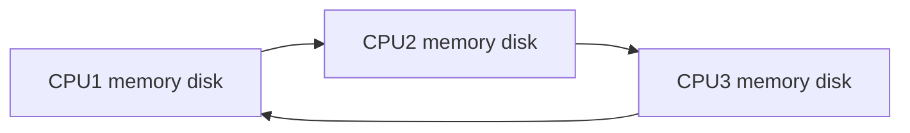
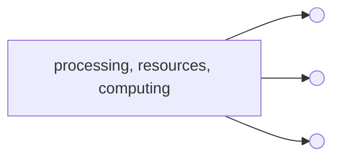

# Cluster vs Cloud vs Grid

## Cluster
A cluster is usually a concept of several servers that work together, usually dividing the load between them so that from the outside 
the can be regarded as a single system. Simply, cluster is a very general pattern for dividing workload and providing redundancy to 
prevent failure.

## Grid
A grid often refers to a set of servers that work together on a given massive computation. Instead of just distributing the workload 
coming from many customers, they divide a single job into sub parts, providing the job the total resources that are available (or at 
least a dedicated set of servers which is a subset of the grid).

## Cloud
A cloud is a unique form of a cluster. The main goal of the cloud is the effective use of resources. The resources are allocated on demand 
and later released to the pool for serving other needs. The cloud is virtualized, in the sense that the workload is not aware about the 
actual physical location and resources processing it. Also the user is not enabled to directly access these physical resources but rather 
is allotted access to the logical servers it consumes. The cloud is also built for self-service. This means the user gets resources and 
defines networking between the resources using APIs or UI without admin intervention. Finally, a cloud architecture allows workloads to 
scale up and to scale out by requesting more resources when needed.

## 

|Cluster         |Grid                           |Cloud                         |
|----------------|-------------------------------|-----------------------------|
|Stand alone	 | |             |
|           | | |
|           | | |

# Centralized vs Distributed

## Distribted

## Centralized

## 

|     |Cient-Server  |peer to peer |
|----------------|-------------------------------|-----------------------------|
|Pros |A client server can be scaled up to many services that can also be used by multiple users. <li>Security is more advanced than a peer-to-peer network, you can have passwords to own individual profiles so that nobody can access anything when they want.  All the data is stored onto the servers which generally have far greater security controls than most clients. server can control the access and resources better to guarantee that only those clients with the appropriate permissions may access and change data.|Easy and simple to set up only requiring a hub or a switch to connect all computers together.  You can access any file on the computer as-long as it is set to a shared folder.  If one computer fails to work all the other computers connected to it still continue to work.|
|Cons |More expensive than a peer-to-peer network you have to pay for the start up cost.  When the server goes down or crashes all the computers connected to it become unavailable to use.  When you expend the server it starts to slow down due to the Bit rate per second.  When everyone tries to do the same thing it takes a little while for the server to do certain tasks.|Security is not good other than setting passwords for files that you don't want people to access.  If the connections are not connected to the computers properly then there can be problems accessing certain files.  It does not run efficient if you have many computers, it is best to used two to eight computers.|
