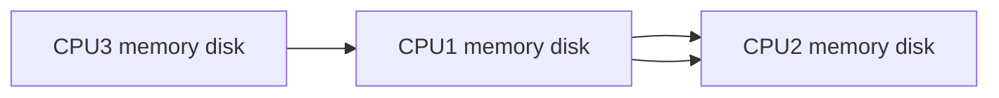

# Cluster vs Cloud vs Grid

## Cluster
A cluster is usually a concept of several servers that work together, usually dividing the load between them so that from the outside 
the can be regarded as a single system. Simply, cluster is a very general pattern for dividing workload and providing redundancy to 
prevent failure.

## Grid
A grid often refers to a set of servers that work together on a given massive computation. Instead of just distributing the workload 
coming from many customers, they divide a single job into sub parts, providing the job the total resources that are available (or at 
least a dedicated set of servers which is a subset of the grid).

## Cloud
A cloud is a unique form of a cluster. The main goal of the cloud is the effective use of resources. The resources are allocated on demand 
and later released to the pool for serving other needs. The cloud is virtualized, in the sense that the workload is not aware about the 
actual physical location and resources processing it. Also the user is not enabled to directly access these physical resources but rather 
is allotted access to the logical servers it consumes. The cloud is also built for self-service. This means the user gets resources and 
defines networking between the resources using APIs or UI without admin intervention. Finally, a cloud architecture allows workloads to 
scale up and to scale out by requesting more resources when needed.

## 

|Cluster         |Grid                           |Cloud                         |
|----------------|-------------------------------|-----------------------------|
|Stand alone	 | |             |
|           | | |
|           | | |

# Centralized vs Distributed

## Distribted



## Centralized

```mermaid
graph LR
A[processing, resources, computing] --> D(())
A --> B(())
A --> C(())
```

