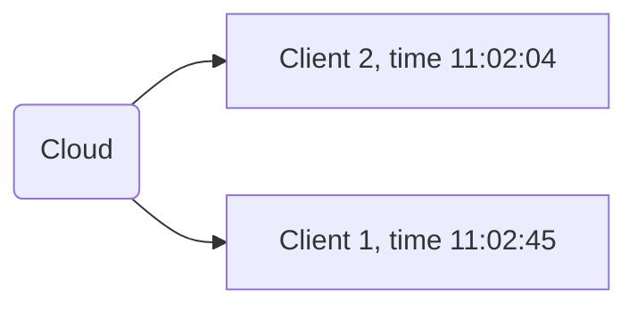
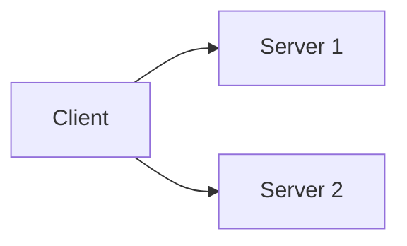

# Fundamental Model:

Model share some fundalmental attributes.

## Interaction model

### Is it ok to send everything to cloud (client-server model)?

Point of cell: things attached in client. When the server cannot supprt client yet, then the info will be stored in here

#### Clock event

## Failure model

In 3 aspects: hardware, software, network

In synchronous system, if the client send the request t server and server fails to respond, if no specific method implemented, then the client will keep waiting. One one the strategy to against this is using time-out.After the time out, the client can resend the request, or no waiting anyore

Only applicable in synchronous system, since in asynchronous system there is no such thing called time out. since in asynchronous, after the client shall execute another task but no waiting to response. So if also use time-out, then client will keeps sending the message to server including in the case server already crashed, and there is no way client can no abt this crash.

Instead of that, asynchronous use Replica, send request to diferrent servers

## Security model

## 

Online processing vs Offline processing vs Batch processing
* Batch process: receive multi request and process all at one time
* Online: Transaction
